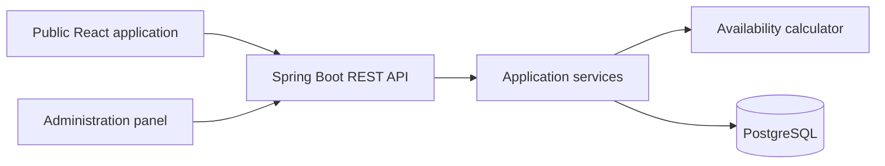

# AtelierByPT

AtelierByPT is a full-stack scheduling and salon management application built
for a working lash and brow stylist. It combines a public portfolio website
with an authenticated administration panel for managing clients, services,
appointments and availability.

The project replaces paper-based appointment planning with a calendar governed
by explicit business rules. Public visitors can check proposed appointment
times, while the stylist retains flexible control over the actual schedule.

> Project status: AtelierByPT 2.0 release candidate accepted by the stakeholder
> and undergoing production rollout.

## Demo

- [Live demo](https://atelierbypt-frontend-beta.onrender.com)
- [Public API example](https://atelierbypt-backend-beta.onrender.com/api/public/working-hours)

The administration panel is protected and demo credentials are not published.
The demo contains fictional data only. Its free Render backend can require a
short warm-up on the first request.

## Main features

### Public website

- Responsive presentation of the atelier, services and qualifications
- Offer and pricing loaded from the backend
- Public working-hours summary
- Service selection followed by a monthly availability calendar
- Appointment starts matched to the selected service duration
- Contact information, social links, privacy policy and terms
- Google Maps loaded only after an explicit privacy choice

### Administration panel

- JWT-based administrator authentication
- Client management with soft deletion
- Service and pricing management
- Daily and weekly appointment calendar
- Appointment creation, editing, cancellation and archival
- Terminal appointment statuses that prevent accidental restoration
- Recurring working hours for each weekday
- Closed days, blocked periods and additional opening hours
- Configurable interval between public appointment suggestions

## Availability rules

Availability is calculated on the backend from:

1. recurring weekly working hours;
2. date-specific exceptions (`CLOSED_DAY`, `BLOCKED`, `EXTRA_OPEN`);
3. active scheduled appointments;
4. elapsed time for the current day;
5. the duration of the service selected by the visitor.

A shared calculator is used by appointment validation, the administration
calendar and the public calendar. This prevents the frontend and backend from
maintaining separate interpretations of the same business rules.

The public calendar applies an additional presentation policy. The visitor
selects a service first, and its duration determines how much uninterrupted
free time is required. A configurable weekday interval (120 minutes by
default) controls the proposed starts within each real free range. A suggestion
is returned only when the entire selected service fits within that range.

## Architecture



The backend follows a controller → service → repository structure. Database
changes are versioned with Flyway, and request/response DTOs separate the HTTP
contract from persistence entities.

## Technology

### Backend

- Java 21
- Spring Boot 3
- Spring Web, Security, Validation and Data JPA
- JWT authentication and BCrypt password hashing
- PostgreSQL
- Flyway
- JUnit 5, Mockito and Spring Security Test
- Maven

### Frontend

- React 19
- React Router
- Vite
- Tailwind CSS
- Axios
- ESLint

### Delivery

- Docker
- Render
- GitHub Actions

## Repository structure

```text
.
├── backend/               Spring Boot REST API
├── frontend/              React application
├── docs/                  Additional project notes
├── docker-compose.yml     Local PostgreSQL
└── .github/workflows/     Continuous integration
```

## Running locally

### Requirements

- Java 21
- Node.js 22
- Docker with Docker Compose

### 1. Start PostgreSQL

```bash
docker compose up -d
```

The local database settings from `docker-compose.yml` match the default
development values used by the backend.

### 2. Start the backend

Create a Base64-encoded JWT secret:

```bash
openssl rand -base64 32
```

Export the required configuration and start Spring Boot:

```bash
cd backend

export JWT_SECRET="<generated-secret>"
export ADMIN_BOOTSTRAP_ENABLED="true"
export ADMIN_USERNAME="<local-admin-name>"
export ADMIN_PASSWORD="<local-admin-password>"

./mvnw spring-boot:run
```

Flyway creates and validates the database schema automatically. Disable
`ADMIN_BOOTSTRAP_ENABLED` after the initial administrator has been created.

### 3. Start the frontend

Create `frontend/.env.local`:

```dotenv
VITE_API_URL=http://localhost:8080
```

Then run:

```bash
cd frontend
npm ci
npm run dev
```

The application is available at `http://localhost:5173`.

## Configuration

### Backend environment variables

| Variable | Purpose | Default |
| --- | --- | --- |
| `SPRING_DATASOURCE_URL` | PostgreSQL JDBC URL | Local Atelier database |
| `SPRING_DATASOURCE_USERNAME` | Database username | `atelier_user` |
| `SPRING_DATASOURCE_PASSWORD` | Database password | `atelier_password` |
| `JWT_SECRET` | Base64 signing key | Required |
| `JWT_EXPIRATION` | Token lifetime in milliseconds | `3600000` |
| `CORS_ALLOWED_ORIGIN` | Allowed frontend origin | `http://localhost:5173` |
| `ADMIN_BOOTSTRAP_ENABLED` | Enables initial administrator creation | `false` |
| `ADMIN_USERNAME` | Initial administrator username | Empty |
| `ADMIN_PASSWORD` | Initial administrator password | Empty |
| `JPA_SHOW_SQL` | SQL logging | `false` |
| `LOGIN_MAX_FAILED_ATTEMPTS` | Failed attempts before temporary login lock | `5` |
| `LOGIN_ATTEMPT_WINDOW_MINUTES` | Window for counting failed login attempts | `15` |
| `LOGIN_LOCK_DURATION_MINUTES` | Login lock duration after reaching the limit | `15` |
| `SPRINGDOC_API_DOCS_ENABLED` | OpenAPI endpoint | `true` |
| `SPRINGDOC_SWAGGER_UI_ENABLED` | Swagger UI | `true` |

Production secrets must be provided through the hosting platform and must never
be committed to the repository.

## Quality checks

Run all backend tests:

```bash
cd backend
./mvnw test
```

Run frontend verification:

```bash
cd frontend
npm ci
npm run lint
npm run build
```

GitHub Actions performs these checks automatically for pushes and pull
requests.

The manual beta, data-safety and deployment steps are listed in the
[release checklist](docs/release-checklist.md). The production setup and
rollback procedure are documented in the
[production deployment runbook](docs/production-deployment.md).

## Security and privacy

- `/api/admin/**` requires the `ADMIN` role.
- Only `/api/auth/**`, `/api/public/**` and development documentation endpoints
  are explicitly public.
- The backend uses stateless JWT authentication.
- Passwords are stored as BCrypt hashes.
- Repeated failed login attempts cause a temporary login lock.
- Production CORS accepts only the configured frontend origin.
- Swagger and API documentation should be disabled in production.
- Google Maps is not requested until the visitor explicitly accepts external
  content and the choice can be changed later.
- Real client data requires controlled access, database backups and an agreed
  deletion or anonymisation procedure.

## Environments and branches

The public demo and production deployment use the same application code but
separate infrastructure, secrets and databases:

| Branch | Environment | Data |
| --- | --- | --- |
| `demo` | developer-owned Render demo | fictional only |
| `main` | Atelier-owned production Render services | real client data |
| `feature/*` | temporary development work | local or test data |

Changes are validated on a feature branch, promoted to `demo` for acceptance,
and merged into `main` only when ready for production.

## Development approach

The application was developed incrementally around a real business workflow.
AI-assisted development was used during later auditing, availability
refactoring and test generation. Generated changes were reviewed, divided into
small commits and verified with automated and manual tests.

## Planned development

Features considered after the AtelierByPT 2.0 release:

- database-managed public gallery;
- editable qualifications;
- news and announcements;
- end-to-end tests for the primary administrator workflow;
- stronger protection against concurrent appointment creation.

## Author

Created by **Grzegorz Dżyg**

- [LinkedIn](https://www.linkedin.com/in/gregdzyg/)
